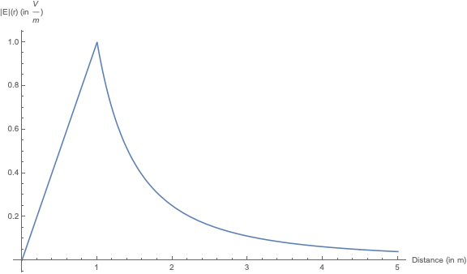
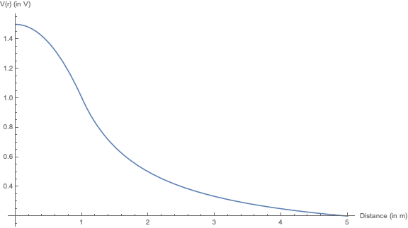

# Problem 2.7

> Find the electric field at a distance $z$ from the center of a spherical surface of radius $R$ that carries a uniform charge density $\sigma$. Treat both the case of inside and outside the shell and express your answer in terms of the total charge $q$ on the sphere.

Since no thickness is specified, we will assume that the spherical surface can be considered as a shell with infinitesimal thickness or similarly treated as a $S^2$ (2-sphere). Since the *surface* charge density is given as being uniform across $S^2$, we can immediately assume that the electric field will also respect this inherent symmetry. This exercise is trivial using the integrated form of Gauss's law, as the electric field outside a spherical symmetric charge is equivalent to that of a point mass and as the shell is hollow, the enclosed charge is zero, and so must be the field.

$$\begin{aligned}
\int_{S^2}{\lvert\vec{E}\rvert dA} &= \frac{Q_{enc}}{\epsilon_0}\\
\lvert\vec{E}\rvert\left(\int^{\phi=2\pi}_{\phi=0}{\int_{\theta=0}^{\theta=\pi}{r^2\sin{\theta}d\theta d\phi}}\right) &= \frac{Q_{enc}}{\epsilon_0}\\
\lvert\vec{E}\rvert 4\pi r^2 &= \frac{Q_{enc}}{\epsilon_0}\\
\vec{E} &= \frac{1}{4\pi \epsilon_0}\frac{q}{r^2}\Theta(r-R)\hat{r}
\end{aligned}$$

Alternatively, instead of just citing [Newton's Shell theorem](https://en.wikipedia.org/wiki/Shell_theorem) or symmetry, we can verify the results of Gauss's Law are true by integrating the electric field as measured at $z$. Without loss of generality, let us set the spherical shell centered on the origin and the point of interest at length $z$ away. Due to the spherical nature of the physical situation, we can define our position vectors in spherical coordinates.[^5]

$$\vec{r}=z\hat{r}, \qquad \vec{r'}=R\hat{r}'$$

\begin{figure}
   \centering
   \tdplotsetmaincoords{60}{115}
   \pgfplotsset{compat=newest}

   \begin{tikzpicture}[tdplot_main_coords, scale = 2.5]

   % Create a point (SpacePoint)
   \coordinate (SpacePoint) at (0,0,1.5);

   % Create a point (SourcePoint)
   \coordinate (SourcePoint) at ({1/sqrt(3)},{1/sqrt(3)},{1/sqrt(3)});

   % Draw shaded circle
   \shade[ball color = lightgray,
       opacity = 0.25
   ] (0,0,0) circle (1cm);

   % draw arcs
   \tdplotsetrotatedcoords{0}{0}{0};
   \draw[dashed,
       tdplot_rotated_coords,
       gray
   ] (0,0,0) circle (1);

   \tdplotsetrotatedcoords{90}{90}{90};
   \draw[dashed,
       tdplot_rotated_coords,
       gray
   ] (1,0,0) arc (0:180:1);

   \tdplotsetrotatedcoords{0}{90}{90};
   \draw[dashed,
       tdplot_rotated_coords,
       gray
   ] (1,0,0) arc (0:180:1);

   % Projection of the SourcePoint on X and y axes
   \draw[thin, dashed] (SourcePoint) --++ (0,0,{-1/sqrt(3)});
   \draw[thin, dashed] ({1/sqrt(3)},{1/sqrt(3)},0) --++
   (0,{-1/sqrt(3)},0);
   \draw[thin, dashed] ({1/sqrt(3)},{1/sqrt(3)},0) --++
   ({-1/sqrt(3)},0,0);

   % Axes in 3 d coordinate system
   \draw[-stealth] (0,0,0) -- (2,0,0)
       node[below left] {$\hat{x}$};

   \draw[-stealth] (0,0,0) -- (0,1.5,0)
       node[below right] {$\hat{y}$};

   \draw[-stealth] (0,0,0) -- (0,0,2)
       node[above] {$\hat{z}$};

   \draw[dashed, gray] (0,0,0) -- (-1,0,0);
   \draw[dashed, gray] (0,0,0) -- (0,-1,0);

   % Line from the origin to (SpacePoint)
   \draw[thick, -stealth] (0,0,0) -- (SpacePoint) node[midway, left] {$\vec{r}$};

   % Line from the origin to (SpacePoint)
   \node at (SpacePoint) [above, left]  {$z$};

   % Line from the origin to (SourcePoint)
   \node at (SourcePoint) [right]  {$dq$};

   % Line from the origin to (SourcePoint)
   \draw[thick, -stealth] (0,0,0) -- (SourcePoint) node[midway, below] {$\vec{r'}$};

   % Line from the SourcePoint to (SpacePoint)
   \draw[thick, -stealth] (SourcePoint) -- (SpacePoint) node[midway, right] {$\vec{r} - \vec{r'}$};

   \end{tikzpicture}

  \caption{A visual representation of the vector describing the distance and direction from $dq$ to the point in question: $z$ (placed outside for reduction of visual noise).}

\end{figure}

Recalling that $\hat{r}$ doesn't always point in the same direction as $\hat{r}'$, we can convert these vectors[^1] to a coordinate system that has constant directions across all space: Cartesian.

[^5]: The figure was made by using this [tutorial](https://latexdraw.com/draw-a-sphere-in-latex-using-tikz/) as a template and then adjusting to match the physical situation. The LaTeX code used to generate it can be found at https://simmeringrook.github.io/#/latex/figures/Sphere.

$$\vec{r}=z(\sin{\theta}\cos{\phi}\hat{x}+\sin{\theta}\sin{\phi}\hat{y}+\cos{\theta}\hat{z}), \qquad \vec{r'}=R(\sin{\theta'}\cos{\phi'}\hat{x}+\sin{\theta'}\sin{\phi'}\hat{y}+\cos{\theta'}\hat{z})$$

[^1]: Here, we leverage the endpages of Griffth's 4th Edition in which he kindly provides the basis vectors for Cartesian, Cylindrical, and Spherical coordinate systems in terms of each other.

Using the fact that as we change the angle $\phi$ and $\theta$ of $\vec{r}$, the charge distribution observed by the point of interest a distance $z$ from the origin looks the same, we conclude that the field cannot depend on the $\phi$ or $\theta$ coordinates of $\vec{r}$. Similarly, we can repeat this process inside the sphere and be unable to tell if the sphere has been rotated about $\vec{r}$ in $\phi'$ or $\theta'$ or if $\vec{r}$ itself has been rotated ($\phi$, $\theta$) as the charge density is uniform. We then leverage this to remove all $\phi$ and $\phi'$ from consideration in our calculations by choosing the convent value of $\phi=\phi'=0$.

$$\vec{r}=z(\sin{\theta}\hat{x}+\cos{\theta}\hat{z}), \qquad \vec{r'}=R(\sin{\theta'}\hat{x}+\cos{\theta'}\hat{z})$$

Both inside and outside the shell, we note that $\theta$ does not impact the charge distribution observed from $\vec{r}$, and so we again choose the extremely convenient value of $\theta=0$, which is the equivalent of lining up $\hat{r}$ parallel to the $z$-axis (and which makes the most logical sense given the arbitrary name for the distance in question).

$$\vec{r}=z\hat{z}, \qquad \vec{r'}=R(\sin{\theta'}\hat{x}+\cos{\theta'}\hat{z})$$

The same cannot be said for $\vec{r'}$, however, as we consider each bit of $dq$ on the $S^2$. Intuitively, this small dependence on $\theta'$ makes sense as the total distance from $z$ to the *North* pole ($\theta'=0$) is the minimum (implicitly assuming $z>R>0$ at this moment) with a total distance of $z-R$ and that the total distance from $z$ to the *South* pole ($\theta'=\pi$) is the maximum with $z+R$. Now that our position vectors are happily sharing the same basis vectors, we can subtract them to find the distance between each bit of $dq$ and $z$.

$$\vec{r}-\vec{r'}=(-R\sin{\theta'})\hat{x}+(z-R\cos{\theta'})\hat{z}$$

We now all the components required to sum up all of the $d\vec{E}$ contributions from each bit of $dq$[^2]:

[^2]: Recall that $q=\int{\lambda dr}=\int_{S}{\sigma dA}=\int_{V}{\rho dV}$ and therefore, $dq=\sigma dA = \sigma {r'}^2 \sin{\theta'}d\phi'd\theta'$

$$\begin{aligned}
d\vec{E}(\vec{r}) &= \frac{dq}{4\pi\epsilon_0}\frac{\vec{r}-\vec{r'}}{{\lvert \vec{r}-\vec{r'}\rvert}^3}\\
&= \frac{\sigma}{4\pi\epsilon_0}\frac{\vec{r}-\vec{r'}}{{\lvert \vec{r}-\vec{r'}\rvert}^3}R^2 \sin{\theta'}d\phi'd\theta'
\end{aligned}$$

Now we finish the substitution and recall that nothing in the integrand depends on $\phi'$:

$$\begin{aligned}
\vec{E}(\vec{r}) &= \frac{\sigma}{4\pi\epsilon_0}\int_{\phi'=0}^{\phi'=2\pi}{ \int_{\theta'=0}^{\theta'=\pi}{ \frac{\vec{r}-\vec{r'}}{{\lvert \vec{r}-\vec{r'}\rvert}^3}R^2 \sin{\theta'}d\phi'd\theta' } } \\
&= \frac{\sigma 2\pi}{4\pi\epsilon_0} \int_{\theta'=0}^{\theta'=\pi}{ \frac{(-R\sin{\theta'})\hat{x}+(z-R\cos{\theta'})\hat{z}}{(z^2 + R^2 (\sin^2{\theta'}+\cos^2{\theta'}) - 2zR\cos{\theta'})^{(3/2)}}R^2 \sin{\theta'}d\theta' } \\
&= \frac{\sigma 2\pi}{4\pi\epsilon_0} \int_{\theta'=0}^{\theta'=\pi}{ \frac{(-R\sin{\theta'})\hat{x}+(z-R\cos{\theta'})\hat{z}}{(z^2 + R^2 - 2zR\cos{\theta'})^{(3/2)}}R^2 \sin{\theta'}d\theta' }
\end{aligned}$$

Note that an alternate derivation of $\vec{r}$ and $\vec{r'}$ could have required Griffith's hint to use the Law of Cosines to simplify the denominator, but we avoided that complication by involving the $x$-component in $\vec{r'}$. I will now argue from the symmetry expressed earlier, that the only directional component that matters for $\vec{E}$ is the $\hat{z}$, as all non-$\hat{z}$ components will cancel each other out as we walk $S^2$. We can then recall the advantage (or necessity) of using Cartesian directions: they are constant throughout all space (and time), and so we may move them outside the integral without problem. Next, we can work on cleaning up this integral into something more reasonable with a u-substitution, Let:

$$u=\cos{\theta'}, \qquad du = -\sin{\theta'}d\theta'$$
$$\theta'=\pi \mapsto u=-1, \qquad theta'=0 \mapsto u=1$$

$$\begin{aligned}
\vec{E}(\vec{r}) &= \frac{\sigma 2\pi R^2}{4\pi\epsilon_0} \hat{z} \int_{\theta'=0}^{\theta'=\pi}{ \frac{(z-R\cos{\theta'})\sin{\theta'}d\theta'}{(z^2 + R^2 - 2zR\cos{\theta'})^{(3/2)}}}\\
&= \frac{\sigma 2\pi R^2}{4\pi\epsilon_0} \hat{z} \int_{u=1}^{u=-1}{ \frac{(z-Ru)}{(z^2 + R^2 - 2zRu)^{(3/2)}}}(-du)\\
&= \frac{\sigma 2\pi R^2}{4\pi\epsilon_0} \hat{z} \int_{u=-1}^{u=1}{ \frac{(z-Ru)}{(z^2 + R^2 - 2zRu)^{(3/2)}}}du\\
\end{aligned}$$

Now, while this doesn't appear to really lead to anything easier to integrate, with some inspiration from WolframAlpha that this is in fact something that can be solved not only analytically but also by hand, we can proceed with a very clever and complex second u-substitution. Let:

$$\xi=\sqrt{z^2+R^2-2zRu}, \qquad d\xi =\frac{-zR}{\sqrt{z^2+R^2-2zRu}}du$$

If we substitute at this stage, we'll note that it almost works perfectly with the exception of that pesky $z-Ru$ in the numerator:

$$I = \int_{u=-1}^{u=1}{ \frac{(z-Ru)}{\xi^2}\frac{(-d\xi)}{zR}}$$

However, if we work a little creatively and square $\xi$, we can solve for a relation to replace $-Ru$:

$$\xi^2 = z^2+R^2-2zRu \quad\rightarrow\quad -Ru = \frac{\xi^2 - z^2 - R^2}{2z}$$

And now this becomes a rather elementary integral.

$$\begin{aligned}
I &= \int_{u=-1}^{u=1}{ \frac{(z+\frac{\xi^2 - z^2 - R^2}{2z})}{\xi^2}\frac{(-d\xi)}{zR}}\\
&= -\frac{1}{zR}\int_{u=-1}^{u=1}{ \frac{2z^2 + \xi^2 - z^2 - R^2}{2z\xi^2}d\xi}\\
&= -\frac{1}{2z^2R}\int_{u=-1}^{u=1}{ \frac{z^2 + \xi^2 - R^2}{\xi^2}d\xi}\\
&= - \left(\frac{z^2-R^2}{2z^2 R}\left(\frac{-1}{\xi}\right)-\frac{1}{2z^2 R}{\xi}\middle)\right)^{u=1}_{u=-1}\\
&= \frac{zu-R}{z^2 \sqrt{z^2+R^2-2zRu}}\bigg\rvert^{u=1}_{u=-1}\\
&= \frac{1}{z^2}\left(\frac{z(1)-R}{\sqrt{z^2+R^2-2zR(1)}}-\frac{z(-1)-R}{sqrt{z^2+R^2-2zR(-1)}}\right)\\
&= \frac{1}{z^2}\left(\frac{z-R}{\sqrt{(z-R)^2}}+\frac{z+R}{\sqrt{(z+R)^2}}\right)\\
\end{aligned}$$

Adding back the rest of the the integral, we can proceed with the final steps of this solution. Since the square root in the denominators came from the distance formula and has to be a positive value to make physical sense, we take a moment to note the subtlety of this situation. Recall that the result of $x^2$ is always a positive number (for $x\in\mathbb{R}$), but $x$ can be positive or negative; because the square root is removing the square, we must wrap each denominator with absolute value bars to preserve the functional form.

$$\begin{aligned}
\vec{E}(\vec{r}) &= \frac{\sigma 2\pi R^2}{4\pi\epsilon_0} \hat{z} \underbrace{\int_{u=-1}^{u=1}{ \frac{(z-Ru)}{(z^2 + R^2 - 2zRu)^{(3/2)}}}du}_{I}\\
&= \frac{\sigma 2\pi R^2}{4\pi\epsilon_0} \hat{z} \frac{1}{z^2}\left(\frac{z-R}{\sqrt{(z-R)^2}}+\frac{z+R}{\sqrt{(z+R)^2}}\right)\\
&= \frac{\sigma 2\pi R^2}{4\pi\epsilon_0} \frac{1}{z^2}\left(\frac{z-R}{\lvert z-R \rvert}+\frac{z+R}{\lvert z-R \rvert}\right) \hat{z}
\end{aligned}$$

Functionally, the resulting fractions are similar to the Kronecker Delta in that they have a magnitude of $\pm 1$ but the numerator serves as a mechanism for determining the sign. The sign, $sgn$, or signum function is defined as follows:

$$\text{sgn}(x) \equiv \begin{cases} 1 \quad & x > 0 \\ 0 \quad & x = 0 \\ -1 \quad & x < 0 \\ \end{cases}$$

And so now we evaluate the field inside and outside the hollow sphere:

$$|z| > |R| \mapsto \begin{cases} z+R > z-R > 0 \quad & \text{sgn}(z-R)+\text{sgn}(z+R)=2 \\ 0 > z-R > z+R \quad & \text{sgn}(z-R)=\text{sgn}(z+R)=-2 \\ \end{cases}$$

$$|z| < |R| \mapsto \begin{cases} 0 > z+R > z-R \quad & \underbrace{\text{sgn}(z-R)}_{-1} + \underbrace{\text{sgn}(z+R)}_{1} = 0 \\ z-R > 0 > z+R \quad & \underbrace{\text{sgn}(z-R)}_{1} + \underbrace{\text{sgn}(z+R)}_{-1} = 0 \\ \end{cases}$$

We then substitute this into our calculate $\vec{E}$:

$$\begin{aligned}
\vec{E}(\vec{r}) &= \frac{\sigma 2\pi R^2}{4\pi\epsilon_0} \frac{\text{sgn}(z-R) + \text{sgn}(z+R)}{z^2} \hat{z} \\
&= \frac{1}{4\pi\epsilon_0}\begin{cases} \pm 4\pi R^2 \sigma \frac{\hat{z}}{z^2} \quad & |z| > |R| \\ 0 \quad & |z| < |R|
\end{cases}
\end{aligned}$$

Having confirmed our findings from Gauss's Law, we then unfix $z$ from the $z$-axis as only the radial distance from the origin matters and we can express the field in its more common form:

$$
\vec{E}(\vec{r}) = \frac{1}{4\pi\epsilon_0}\begin{cases} \frac{q}{r^2}\hat{r} \quad & |r| > |R| \\ 0 \quad & |r| < |R|
\end{cases}
$$

\pagebreak

# Problem 2.8

> Use your results from the electric field for a spherical shell to find the field outside and inside a solid sphere, still with total charge $q$, a radius of $R$, and a uniform volume charge density $\rho$. Draw a graph of $|E|$ as a function of distance from the center.

Since both the total charge and spherical symmetry remain unchanged, we know through Gauss's Law that the electric field outside the (now) solid sphere is the same:

$$\vec{E}(\vec{r}) = \frac{1}{4\pi\epsilon_0}\frac{q}{r^2}\hat{r}$$

The verification is simple, as we just place our Gaussian sphere outside the solid sphere $(r > R)$ and note that the enclosed charge is equivalent to the total charge.

$$\begin{aligned}
\int_{S}{\lvert\vec{E}\rvert dA} &= \frac{Q_{enc}}{\epsilon_0}\\
\lvert\vec{E}\rvert\left(\int^{\phi=2\pi}_{\phi=0}{\int_{\theta=0}^{\theta=\pi}{r^2\sin{\theta}d\theta d\phi}}\right) &= \frac{Q_{enc}}{\epsilon_0}\\
\lvert\vec{E}\rvert 4\pi r^2 &= \frac{Q_{enc}}{\epsilon_0}\\
\vec{E} &= \frac{1}{4\pi \epsilon_0}\frac{q}{r^2}\hat{r} \quad (r > R)
\end{aligned}$$

Both this problem and the previous problem are perfect examples of how charges with spherical symmetry are indistinguishable from each other and act like point charges when creating their electric field. The more interesting case is what occurs inside the sphere: We can either be aware of [Newton's Shell theorem](https://en.wikipedia.org/wiki/Shell_theorem) or happen to watch a standup Mathematician's YouTube channel for inspiration on how to treat the solid sphere case. We can reuse all the work from our previous Gauss's Law calculation, but note that $q_{enc}$ is no longer equal to $q$. Implicitly, we know the field has to be weaker, but the question is by what proportionality?

Having watch Matt Parker's two videos regarding ["How to mathematically calculate a fall through the Earth"](https://www.youtube.com/watch?v=s94Gojs3Ags), let us reconsider the solid sphere as just a series of concentric spherical shells[^3]. If we remove the outermost shell, we won't have violated our symmetry, and so we expect the same functional form for the electric field, but just weaker by some $\Delta q$.

[^3]: Alternatively: an [onion](https://www.youtube.com/watch?v=-FtCTW2rVFM).

From the previous problem, we know explicitly that there is no electric field inside that outer shell that we've removed, and so we're in an equivalent situation to falling through the center of the Earth: As we pass (or remove) each shell, the remaining field we observe is weaker, and the field from any layers *above* us cancels itself out. We can show this explicitly by picking up where we left off in 2.7 after simplifying the last integral.

$$\begin{aligned}
\vec{E}(\vec{r}) &= \frac{\sigma 2\pi R^2}{4\pi\epsilon_0} \frac{\text{sgn}(z-R) + \text{sgn}(z+R)}{z^2} \hat{z} \\
&= \frac{1}{4\pi\epsilon_0}\begin{cases} \pm 4\pi R^2 \sigma \frac{\hat{z}}{z^2} \quad & |z| > |R| \\ 0 \quad & |z| < |R|
\end{cases}
\end{aligned}$$

The immediate difference is that we need to swap $\sigma$ for $\rho$ and change our $dA$ at the beginning to $dV$. The more subtle difference is that there are two cases present here, and so we must integrate the field across two regions of $dr'$:

$$\begin{aligned}
\vec{E}(\vec{r}) &= \frac{\rho 2\pi}{4\pi\epsilon_0}\frac{\hat{z}}{z^2} \int_{0}^{R}{(\text{sgn}(z-r') + \text{sgn}(z+r'))({r'}^2 dr')} \\
&= \frac{\rho 2\pi}{4\pi\epsilon_0}\frac{\hat{z}}{z^2} \left(\underbrace{\int_{0}^{z}{(\text{sgn}(z-r') + \text{sgn}(z+r'))({r'}^2 dr')}}_{\text{inner shells}} + \underbrace{\int_{z}^{R}{(\text{sgn}(z-r') + \text{sgn}(z+r'))({r'}^2 dr')}}_{\text{outer shells}}\right) \\
\end{aligned}$$

For the inner shells, $r'<z$ causing both signum functions to evaluate to $+1$ across the interval. The outer shells, like perviously show, $r' > z$, and so we obtain a $0$ contribution from that field.

$$\begin{aligned}
\vec{E}(\vec{r}) &= \frac{\rho 2\pi}{4\pi\epsilon_0}\frac{\hat{z}}{z^2} \left(\underbrace{2\int_{0}^{z}{{r'}^2 dr'}}_{\text{inner shells}} + \underbrace{\int_{z}^{R}{0}}_{\text{outer shells}}\right) \\
&= \frac{\rho 4\pi}{4\pi\epsilon_0}\frac{\hat{z}}{z^2} \frac{{r'}^3}{3}\bigg\rvert_{r'=0}^{r'=z} \\
&= \frac{1}{4\pi\epsilon_0}\left(\rho \frac{4}{3}\pi z^3\right)\frac{\hat{z}}{z^2}
\end{aligned}$$

Now to express this electric field in terms of the total charge $q$, we use the fact that $q=\int_{V}{\rho dV}$ to introduce a clever form of one.

$$\vec{E}(\vec{r}) = \frac{1}{4\pi\epsilon_0}\left(\frac{\rho \frac{4}{3}\pi z^3}{\rho \frac{4}{3}\pi R^3}q\right)\frac{\hat{z}}{z^2}$$

Once again, having confirmed our findings from Gauss's Law, we then unfix $z$ from the $z$-axis as only the radial distance from the origin matters and we can express the field in its more common form:

$$
\vec{E}(\vec{r}) = \frac{1}{4\pi\epsilon_0}\left(\frac{\rho \frac{4}{3}\pi r^3}{\rho \frac{4}{3}\pi R^3}q\right)\frac{\hat{r}}{r^2}
$$

```Mathematica
R = 1;
q = 1;
Subscript[\[Epsilon], 0] = 1;
Plot[Piecewise[{{(r*q)/Subscript[\[Epsilon], 0], r <= R}, {q/(
    Subscript[\[Epsilon], 0] r^2), r > R}}], {r, 0, 5 R},
 AxesLabel -> {"Distance", "|E|"}, ImageSize -> Large]
```



\pagebreak

# Problem 2.21

> Find the potential inside and outside a uniformly charged solid sphere whose radius is $R$ and total charge is $q$. Use infinity at your reference point. Then compute the gradient of $V$ in each region and check that it yields the correct field. Sketch $V(r)$.

Recalling that the potential in electrostatics is a line integral from our reference point to the area in question, we gather our results from Problem 2.8. There's not much to explain or justify in this problem, as it is just a very straightforward calculation and verification of results by leveraging the relationships between $V$ and $\vec{E}$.

$$V(r) - V(\infty)=-\int_{\infty}^{r}{\vec{E}\cdot d\vec{\ell}}$$

$$\begin{aligned}
V_{outside} &= - \int_{\infty}^{r}{\vec{E}\cdot d\vec{\ell}} = - \int_{\infty}^{r}{\vec{E}\cdot dz\hat{z}}\\
&=  -\frac{1}{4\pi\epsilon_0} \int_{\infty}^{r}{\left(\frac{\rho \frac{4}{3}\pi R^3}{\rho \frac{4}{3}\pi R^3}q\right)\frac{\hat{z}}{z^2}\cdot dz\hat{z}}\\
&= -\frac{q}{4\pi\epsilon_0} \int_{\infty}^{r}{\frac{1}{z^2}dz} \\
&= -\frac{q}{4\pi\epsilon_0} \left( -\frac{1}{z}\bigg\rvert_{\infty}^{r}\right) \\
&= \frac{q}{4\pi\epsilon_0} \left( \frac{1}{r} - \frac{1}{\infty}\right) \\
&= \frac{1}{4\pi\epsilon_0} \frac{q}{r}
\end{aligned}$$

$$\begin{aligned}
V_{inside} &= - \int_{\infty}^{r}{\vec{E}\cdot d\vec{\ell}} = - \int_{\infty}^{r}{\vec{E}\cdot dz\hat{z}}\\
&=  -\frac{1}{4\pi\epsilon_0} \int_{\infty}^{r}{\left(\frac{\rho \frac{4}{3}\pi z^3}{\rho \frac{4}{3}\pi R^3}q\right)\frac{\hat{z}}{z^2}\cdot dz\hat{z}}\\
&= -\frac{1}{4\pi\epsilon_0} \left( \int_{\infty}^{R}{\left(\frac{\rho \frac{4}{3}\pi R^3}{\rho \frac{4}{3}\pi R^3}q\right)\frac{1}{z^2}dz} + \int_{R}^{r}{\left(\frac{\rho \frac{4}{3}\pi z^3}{\rho \frac{4}{3}\pi R^3}q\right)\frac{1}{z^2}dz} \right) \\
&= -\frac{q}{4\pi\epsilon_0} \left( \int_{\infty}^{R}{\frac{1}{z^2}dz} + \frac{1}{R^3}\int_{R}^{r}{zdz} \right) \\
&= -\frac{q}{4\pi\epsilon_0} \left( -\frac{1}{z}\bigg\rvert_{\infty}^{R} + \frac{z^2}{2R^3}\bigg\rvert_{R}^{r} \right) \\
&= \frac{q}{4\pi\epsilon_0} \left( \frac{1}{R} - \frac{1}{\infty} - \frac{r^2}{2R^3} + \frac{R^2}{2R^3} \right) \\
&= \frac{q}{4\pi\epsilon_0} \left( \frac{2R^2-r^2+R^2}{2R^3}\right) \\
&= \frac{q}{4\pi\epsilon_0} \left( \frac{3R^2-r^2}{2R^3}\right)
\end{aligned}$$

Note that $r$ only denotes the radial distance from the origin, and in principle is a dummy variable. Since $V$ is a scalar and has no notion of direction, we can choose to relabel this variable back to $z$ to be consistent with the coordinate system that the field was introduced with.

$$\vec{E}(\vec{r}) = -\vec{\nabla} V(r)$$

$$\newcommand\wrap[2]{\left(#1\right)_{#2}}
\newcommand\pder[2]{\frac{\partial #1}{\partial #2}}
\begin{aligned}
\vec{E}(\vec{r}) &= - \wrap{\pder{}{x}\hat{x}+\pder{}{y}\hat{y}+\pder{}{z}\hat{z}}{} V_{outside}\\
&= -\wrap{\pder{}{z}\hat{z}}{} \left(\frac{1}{4\pi\epsilon_0} \frac{q}{z}\right)\\
&= -\frac{q}{4\pi\epsilon_0} \left(\frac{-1}{z^2}\right)\hat{z} \\
&= \frac{q}{4\pi\epsilon_0} \frac{\hat{z}}{z^2}
\end{aligned}$$

$$\newcommand\wrap[2]{\left(#1\right)_{#2}}
\newcommand\pder[2]{\frac{\partial #1}{\partial #2}}
\begin{aligned}
\vec{E}(\vec{r}) &= - \wrap{\pder{}{x}\hat{x}+\pder{}{y}\hat{y}+\pder{}{z}\hat{z}}{} V_{inside}\\
&= -\wrap{\pder{}{z}\hat{z}}{} \frac{q}{4\pi\epsilon_0} \left( \frac{3R^2-z^2}{2R^3}\right)\\
&= -\frac{q}{4\pi\epsilon_0}\frac{1}{2R^3}\wrap{\pder{}{z}\hat{z}}{}\left(\frac{3}{R} -z^2\right) \\
&= -\frac{q}{4\pi\epsilon_0} \frac{1}{2R^3}\left(0 - 2z\right)\hat{z} \\
&= \frac{1}{4\pi\epsilon_0} \left(\frac{z}{R^3}q\right)\hat{z} \\
&= \frac{1}{4\pi\epsilon_0}\left(\frac{\rho \frac{4}{3}\pi z^3}{\rho \frac{4}{3}\pi R^3}q\right)\frac{\hat{z}}{z^2}
\end{aligned}$$

```Mathematica
R = 1;
q = 1;
Subscript[\[Epsilon], 0] = 1;
Plot[Piecewise[{{q/Subscript[\[Epsilon], 0] ((3 R^2 - r^2)/(2 R^3)),
    r <= R}, {q/(Subscript[\[Epsilon], 0] r), r > R}}], {r, 0, 5 R},
 AxesLabel -> {"Distance (in m)", "V(r) (in V)"}, ImageSize -> Large]
```



\pagebreak

# Problem 2.38

> A metal sphere of radius $R$, carrying charge $q$, is surrounded by a thick concentric metal shell (inner radius $a$, outer radius $b$, as in Fig. 2.48). The shell carries no net charge.

## Part A

> Find the surface charge density $\sigma$ at $R$, $a$, and $b$.

Since this is electrostatics, we can safely assume that the system has reached equilibrium and that all electrons inside the idealized conductor have spaced out in response to the presence of the inner sphere. Let's find the surface charge densities by working our way outwards.

The metal sphere at a charge of $q$ and radius of $R$. Since no constraints were provided on $q$ in terms of position, we can safely assume that the charge of $q$ is uniformly spread out over the metal sphere itself.

$$\begin{aligned}
q &= \int_{S}{\sigma R^2 dA}\\
\sigma_{R} &= \frac{q}{4\pi R^2}
\end{aligned}$$

This surface charge will create the electric field that we are very familiar with in this problem set, which will induce a charge on the inner surface of the concentric shell. For the sake of illustration, if we assume $q$ to be positive, all the free $e^{-}$ in the conductor will have relocated to the inner surface in response to that field and match its charge magnitude (the same concept applies for the $-q$ case).

$$\begin{aligned}
-q &= \int_{S}{\sigma a^2 dA}\\
\sigma_{a} &= \frac{-q}{4\pi a^2}
\end{aligned}$$

And because the electric field is $0$ inside an idealized conductor, we need the outer surface of the shell to have an equivalent charge such that the fields cancel out with superposition.

$$\begin{aligned}
-(-q) &= \int_{S}{\sigma b^2 dA}\\
\sigma_{b} &= \frac{q}{4\pi b^2}
\end{aligned}$$

## Part B

> Find the potential at the center using infinity as the reference point.

$$\vec{E}(\vec{r}) = \frac{1}{4\pi\epsilon_0}\frac{q}{r^2}\hat{r} \begin{cases}
1 \quad & r \in (b,\infty) \\
0 \quad & r \in (a,b) \\
1 \quad & r \in (R,a) \\
0 \quad & r \in (0,R)
\end{cases}$$

When we observe the field outside the shell, we are unable to determine that the *true* source of the charge is from inside the shell, so all we can measure is the typical electric field for a point charge with magnitude $q$. Inside the conducting shell, we have the case stated in Part A: the two surface charge densities $\sigma_a$ and $\sigma_b$ negate each other and there's no field inside. Then, as we move from the inner radius towards the metal sphere, we observe the same field as we did before: its still spherically symmetric in nature, and we would be unaware of the presence of the outer shell as its own fields have canceled each other. Finally, since $\sigma_R$ is a surface charge density, the field inside the metal solid sphere itself is $0$, as there is no charge on the inside[^4].

[^4]: This can be explicitly verified with Gauss's Law, but I think we have sufficiently demonstrated this property by now.

$$V(r) - V(\infty)=-\int_{\infty}^{r}{\vec{E}\cdot d\vec{\ell}}$$

Now, we simply integrate as in Problem 2.21:

$$\begin{aligned}
V(r=0) &= - \int_{\infty}^{r}{\vec{E}\cdot d\vec{\ell}} = - \int_{\infty}^{r}{\vec{E}\cdot dz\hat{z}}\\
&= -\frac{q}{4\pi\epsilon_0} \int_{\infty}^{0}{\frac{\hat{z}}{z^2}\cdot dz\hat{z}}\\
&= -\frac{q}{4\pi\epsilon_0} \left( \int_{\infty}^{b}{\frac{1}{z^2}dz} + \int_{b}^{a}{0} + \int_{a}^{R}{\frac{1}{z^2}dz} + \int_{R}^{0}{0}\right) \\
&= -\frac{q}{4\pi\epsilon_0} \left( -\frac{1}{z}\bigg\rvert_{\infty}^{b} -\frac{1}{z}\bigg\rvert_{a}^{R} \right) \\
&= \frac{q}{4\pi\epsilon_0} \left(\frac{1}{z}\bigg\rvert_{\infty}^{b} + \frac{1}{z}\bigg\rvert_{a}^{R} \right) \\
&= \frac{q}{4\pi\epsilon_0} \left(\frac{1}{b} - \frac{1}{\infty} + \frac{1}{R} - \frac{1}{a} \right) \\
&= \frac{q}{4\pi\epsilon_0} \left(\frac{1}{b} + \frac{1}{R} - \frac{1}{a}\right)
\end{aligned}$$

## Part C

> Now the outer surface is touched to a grounding wire, which drains off charge and lowers its potential to zero (same as at infinity). How do your answers to Part A and B change?

If the grounding wire is serving as a mechanism to remove the charge from the outer shell, then once at equilibrium, there will no longer be any surface charge density: $\sigma_b = 0$. The rest of Part A remains the same as $\sigma_a$ is nonzero due to the presence of $\sigma_R$, and those only change if $q$ or $a$ and $R$ were to also change.

We update our piecewise expression for the electric field and note that this is equivalent to setting the integrand for $r\in(b,\infty)$ to zero.

$$\vec{E}(\vec{r}) = \frac{1}{4\pi\epsilon_0}\frac{q}{r^2}\hat{r} \begin{cases}
0 \quad & r \in (a,\infty) \\
1 \quad & r \in (R,a) \\
0 \quad & r \in (0,R)
\end{cases}$$

Carrying out the calculation more explicitly:

$$\begin{aligned}
V(r=0) &= -\frac{q}{4\pi\epsilon_0} \int_{\infty}^{0}{\frac{\hat{z}}{z^2}\cdot dz\hat{z}}\\
&= -\frac{q}{4\pi\epsilon_0} \left( \int_{\infty}^{a}{0} + \int_{a}^{R}{\frac{1}{z^2}dz} + \int_{R}^{0}{0}\right) \\
&= -\frac{q}{4\pi\epsilon_0} \left( -\frac{1}{z}\bigg\rvert_{a}^{R} \right) \\
&= \frac{q}{4\pi\epsilon_0} \left(\frac{1}{R} - \frac{1}{a}\right)
\end{aligned}$$
