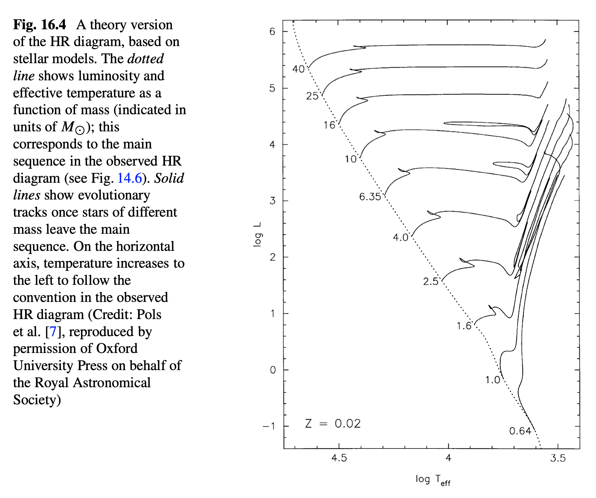

Article title: [*Observables of spheroidal magnetized Strange Stars*](https://arxiv.org/abs/2010.06514v1)

> Why did I choose this article?

I choose this article because I am doing my undergrad Physics research in the context of General Relativity and wanted to try to find a paper that touches on content relevant to AMO and Astrophysics/General Relativity. Luckily, this paper was at the top of my search results and the title and abstract just immediately sold me on the concept of reading and trying to share this content with other people.

Neutron Stars are as fascinating, if not more so, than black holes in that they mix together high densities, degeneracy pressures battling massive gravitational forces, and the interaction between those forces in a *compact* scale.

## Summary

The main focus of this paper is on the area of expanding our description and understanding of Neutron stars (NSs) and their cores. Neutron stars are primarily composed of their namesake: neutrons. Not only is a star comprised mainly of subatomic particles interesting, but this extreme system requires the combination of some intense[^-1] fields of Physics :

- **General Relativity**: because while extremely small and compact, the star has enough mass to curve spacetime.
- **Statistical Mechanics**: [degenerate neutron matter](https://en.wikipedia.org/wiki/Degenerate_matter#Neutron_degeneracy) and [strange quark matter](https://en.wikipedia.org/wiki/QCD_matter) can't be reasonably described by Classical Thermodynamics (in comparison to Main Sequence stars).
- **Quantum Mechanics** (and Quantum Chromodynamics): to model and begin to describe the energy of a system comprised of [quarks](https://en.wikipedia.org/wiki/Quark) (elementary particles that make up the three subatomic particles: electrons, protons, and neutrons).

[-1]: By *intense*, I refer to need for something beyond Classical Mechanics. Normally, we can still approximate other features of a system with Newtonian Mechanics, but in this case, we need to replace each major portion of a Classical description for the problem with its corresponding modern counterpart.  

### Background

Astrophysicists have a good understanding of the overview for the life of a star. Areas of interest and uncertainty currently focus on the formation of a star and their exotic end stages. The main stages of [stellar evolution](https://en.wikipedia.org/wiki/Stellar_evolution) are divided (loosely) into the following sections:

1. Early
    - This covers the time period from the condensing of gas, most likely from a [nebulae](https://en.wikipedia.org/wiki/Molecular_cloud), into the formation of a [protostar](https://en.wikipedia.org/wiki/Protostar) and ultimately into a [Main Sequence Star](https://en.wikipedia.org/wiki/Main_sequence). The central discriminating feature of Main sequence stars are that they are primarily using Hydrogen to fuel the [nuclear fusion](https://en.wikipedia.org/wiki/Nuclear_fusion#Nuclear_fusion_in_stars) occurring in the core. The Sun is still well within the hydrogen stage and is our local main sequence star.
2. Post-Main Sequence
    - As the hydrogen fuel begins to run out, this is the period where the mass (size) of the star starts to dramatically differentiate its life from the paths of others. As the hydrogen core is exhausted, these stars expand as the hydrogen above the now helium core feeds the fusion and the star transitions into a [Red giant](https://en.wikipedia.org/wiki/Red_giant).
3. Late
    - There are a few branching paths that more massive stars can take as they either switch to different fuel sources for fusion. Stars that are not primarily convective can experience periods of instability as easier to fuse material is cycled internally causing the star to flare and flash, [ejecting some of its stellar material](https://en.wikipedia.org/wiki/Stellar_mass_loss) (one form of creating a nebula).
    - Other stars that live through this process ultimately run into the problem where silicon is fused into iron (called the ["Iron peak"](https://en.wikipedia.org/wiki/Iron_peak)). Iron is a big problem for stars as the process requires energy, instead of producing energy. As the iron core grows, the star will eventually collapse producing a [supernova](https://en.wikipedia.org/wiki/Supernova). The explosion ejects the outer layers of the star and reveals the remnant of the core which is either a form of [Neutron star](https://en.wikipedia.org/wiki/Neutron_star) or a [Black Hole](https://en.wikipedia.org/wiki/Black_hole).

The following figure offers a qualitative guide to the aforementioned stages of a star's life (before stellar collapse) through the use of a Hertzsprung–Russell diagram ([HR diagram](https://en.wikipedia.org/wiki/Hertzsprung%E2%80%93Russell_diagram)):

 Image courtesy of Wikipedia user: *Rursus*. [Source](https://commons.wikimedia.org/w/index.php?curid=2047079).

This second figure, from Page 337 of Charles Keeton's *Principles of Astrophysics: Using Gravity and Stellar Physics to Explore the Cosmos*, demonstrates the quantitative uses of an HR diagram to visualize the corresponding Luminosity and Temperature as a function of mass (and as a prediction for the path of stellar evolution for a given star). 

### Why do we care about 'Strange Stars'?

Strange Stars are a sub-classification on Neutron Stars. Under the extreme pressures and intensities that exist inside Neutron Stars, we suppose that the core consists not of subatomic particles, but Strange Matter (SM or SQM for 'Strange Quark Matter'): quarks that come from the decomposed [hadronic](https://en.wikipedia.org/wiki/Hadron) matter (neutrons). The study of quarks are of great interest in our path to understanding the minute building blocks that combine in masses to create the grand structures of life and the properties of our Universe.

The study of Neutron Stars has renewed with increased interest over the past decade, as another sub-classification has promisingly offered an alternative (and concurrent) method of visualizing and recording Gravitational Waves: Pulsars. A prime example of this research can be seen by [NANOGrav's](http://nanograv.org/) work with the [Pulsar Timing Array](http://www.ipta4gw.org/), which has a local presence at Oregon State University through the work done by Dr. Xavier Siemens.

### What's so interesting about this paper?

The authors of this paper make tremendous effort forward in deriving Equations of State (EoS) for these Strange Stars (SSs). What is notable about this physical system is that there are no solutions that provide the EoS for these SSs: either using exact calculations or perturbation theory in [Quantum Chromodynamics](https://en.wikipedia.org/wiki/Quantum_chromodynamics).

Previous attempts to derive equations of state for magnetized Strange Stars arrive at two independent pressure equations. The independence of these equations prevent a coherent description of the macroscopic star and are highly dependent on the model.

This attempt uses the same concept as a launching point but derives a variation similar to the [Tolman-Oppenhimer-Volkoff](https://en.wikipedia.org/wiki/Tolman%E2%80%93Oppenheimer%E2%80%93Volkoff_equation) (TOV) equations by starting with an [axially symmetric metric](link.html) in spherical coordinates. These equations combine coherently to accurately describe observed properties of highly magnetized Neutron stars.

While these results are promising, they are not the end; they only offer a promising path forward, as the equations are still very model dependent.
