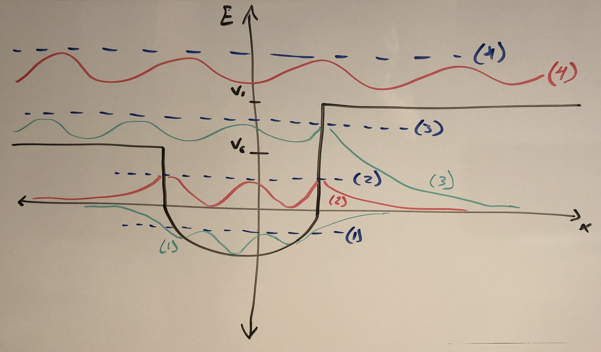

## Prompt

Consider a particle in a 1D porential described by $V(x)$ shown in the figure below. What energy spectra would you expect for the cases of (1), (2), (3), and (4)? Also sketch a wavefunction for these cases. Be as specific as you can about the features.

+------+----------------------+----------------------------+----------------------------+----------------------------+
| Case | Features             | $x < x_1$                  | $x_1\leq x \leq x_2$       | $x_2 < x$                  |
+:====:+:=====================+:===========================+:===========================+:===========================+
| (1)  | - $E<V(x)$           | - real exponential         | - $V(x)-E<0$               | - real exponential         |
|      | - bound state        | - $\psi_E(x) = C_1 e^{kx}$ | - oscillatory              | - $\psi_E(x) = C_1 e^{kx}$ |
|      | - discrete           |                            |                            |                            |
+------+----------------------+----------------------------+----------------------------+----------------------------+
| (2)  | - $E<V(x)$           | - real exponential         | - $V(x)-E<0$               | - real exponential         |
|      | - bound state        | - $\psi_E(x) = C_1 e^{kx}$ | - oscillatory              | - $\psi_E(x) = C_2e^{-kx}$ |
|      | - discrete           |                            |                            |                            |
+------+----------------------+----------------------------+----------------------------+----------------------------+
| (3)  | - $E>V_0$            | - $V_0 - E < 0$            | - $V(x)-E<0$               | - real exponential         |
|      | - unbound state      | - oscillatory              | - oscillatory              | - $\psi_E(x) = C_2e^{-kx}$ |
|      | - continuous         |                            |                            |                            |
+------+----------------------+----------------------------+----------------------------+----------------------------+
| (4)  | - $E>V(x)$           | - $E>V_0$                  | - $V(x)-E<0$               | - $E>V_1$                  |
|      | - unbound state      | - oscillatory              | - oscillatory              | - oscillatory              |
|      | - continuous         |                            |                            |                            |
+------+----------------------+----------------------------+----------------------------+----------------------------+
