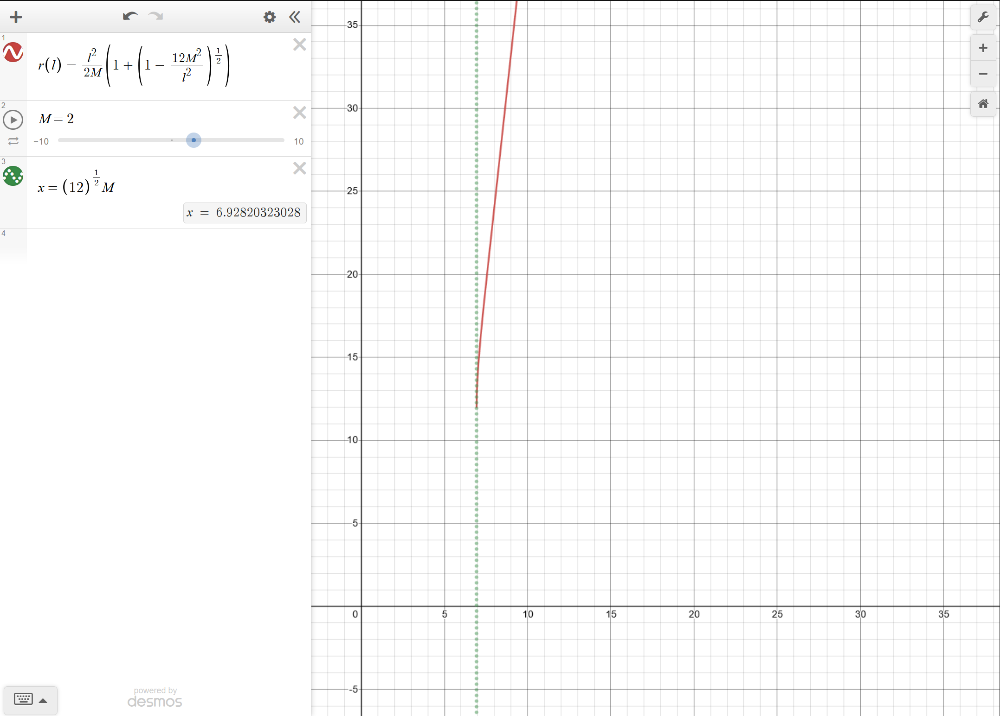

# Chapter 4 Exercises

$$\newcommand\rstar{r^*}\newcommand\Lstar{L^*}\newcommand\Vstar{V^*}\newcommand\wrap[1]{\left( #1 \right)}\newcommand\der[2]{\frac{d #1}{d #2}}
\begin{aligned}
\end{aligned}
$$

Contents:

- [Problem 2](#Prob2)
  - [Part A](#Prob2A)
  - [Part B](#Prob2B)
  - [Part C](#Prob2C)
  - [Part D](#Prob2D)

## Problem 2: Radii of Circular Orbits Around a Black Hole {#Prob2}

Find the radii of circular orbits around a black hole as a function of the angular momentum of the satellite, using the following outline or some other method.

> An object has known angular momentum per unit mass, $L/m$. This value of $L/m$ fixes the effective potential for all $r$-coordinate values. The particle moves in a stable circular orbit if its energy is equal to the minimum in the effective potential. The circular orbit is unstable if the particle energy is equal to the maximum of the effective potential (the peaks of the barriers in the effective potentials of Figures 8, 9, 11, and 12.) A satellite in an unstable orbit is like a pencil balanced on its point and will leave this orbit if perturbed in the slightest.

### Part A {#Prob2A}

> Start with the equation for the square of the effective potential: $$\newcommand\rstar{r^*}\newcommand\Lstar{L^*}\newcommand\Vstar{V^*}\left[ \frac{V(r)}{m} \right]^2 = \left( 1-\frac{2M}{r} \right) \left[1 + \frac{(L/m)^2}{r^2} \right]$$ Make computation simpler by converting to dimensionless units, shown with an asterisk: $$\newcommand\rstar{r^*}\newcommand\Lstar{L^*}\newcommand\Vstar{V^*} \Vstar  = \frac{V(r)}{m},\qquad \rstar = \frac{r}{M},\qquad \Lstar = \frac{L}{mM}$$ Recall that $m$ is the mass of the satellite in whatever units have been chosen for energy and $m$ is the mass of the black hole in meters. Show that in these dimensionless units, the square of the effective potential is: $$\newcommand\rstar{r^*}\newcommand\Lstar{L^*}\newcommand\Vstar{V^*}{\Vstar }^2 = \left(1-\frac{2}{\rstar}\right)\left(1+\frac{{\Lstar}^2}{{\rstar}^2}\right)$$

Starting with the equation for the (square of the) effective potential, we preform the given dimensionless substitutions and find the requested (dimensionless) equation:

$$\newcommand\rstar{r^*}\newcommand\Lstar{L^*}\newcommand\Vstar{V^*}
\begin{aligned}
\left[ \frac{V(r)}{m} \right]^2 &= \left( 1-\frac{2M}{r} \right) \left[1 + \frac{(L/m)^2}{r^2} \right] \\
\left[ \Vstar  \right]^2 &= \left( 1-2\frac{1}{\rstar} \right) \left[1 + \frac{\left(\Lstar M\right)^2}{1}\frac{1}{\left(\rstar M\right)^2} \right] \\
{\Vstar }^2 &= \left(1-\frac{2}{\rstar}\right)\left(1+\frac{{\Lstar}^2}{{\rstar}^2}\right)
\end{aligned}
$$

### Part B {#Prob2B}

> Find the maximum and minimum of this (squared) effective potential by taking its derivative with respect to $\newcommand\rstar{r^*}\rstar$ and setting this derivative equal to zero. Show that the result is: $$\newcommand\rstar{r^*}\newcommand\Lstar{L^*}{\rstar}^2-{\Lstar}^2\rstar+3{\Lstar}^2=0$$

$$\newcommand\rstar{r^*}\newcommand\Lstar{L^*}\newcommand\Vstar{V^*}\frac{d}{d\rstar}\left({\Vstar }^2\right) = 2{\Vstar }\frac{d\Vstar }{d\rstar}$$

This is ultimately just an exercise of heavy algebra and calculus. The calculation, as done *by hand* is shown below:

$$\newcommand\rstar{r^*}\newcommand\Lstar{L^*}\newcommand\Vstar{V^*}\newcommand\wrap[1]{\left( #1 \right)}\newcommand\der[2]{\frac{d #1}{d #2}}
\begin{aligned}
\der{\Vstar }{\rstar} &= \der{}{\rstar} \wrap{\sqrt{1-\frac{2}{\rstar}} \sqrt{1+\frac{{\Lstar}^2}{{\rstar}^2}}} \\
&= \wrap{1+\frac{{\Lstar}^2}{{\rstar}^2}} \der{}{\rstar}\sqrt{1-\frac{2}{\rstar}} + \wrap{1-\frac{2}{\rstar}}\der{}{\rstar} \sqrt{1+\frac{{\Lstar}^2}{{\rstar}^2}}\end{aligned}
$$

Evaluating the chain rule portion inside of the product rule:

$$\newcommand\rstar{r^*}\newcommand\Lstar{L^*}\newcommand\Vstar{V^*}\newcommand\wrap[1]{\left( #1 \right)}\newcommand\der[2]{\frac{d #1}{d #2}}
\begin{aligned}
\der{}{\rstar}\sqrt{1-\frac{2}{\rstar}} &= \frac{1}{2}\wrap{1-\frac{2}{\rstar}}^{-1/2} \wrap{(-2)\frac{-1}{{\rstar}^2}} \\
&= \frac{1}{{\rstar}^2}\wrap{1-\frac{2}{\rstar}}^{-1/2} \\
\\
\der{}{\rstar}\sqrt{1+\frac{{\Lstar}^2}{{\rstar}^2}} &= \frac{1}{2}\wrap{1+\frac{{\Lstar}^2}{{\rstar}^2}}^{-1/2} \wrap{\frac{-2{\Lstar}^2}{{\rstar}^3}} \\
&= -\frac{{\Lstar}^2}{{\rstar}^3}\wrap{1+\frac{{\Lstar}^2}{{\rstar}^2}}^{-1/2} \\
\end{aligned}
$$

Now we can substitute back in:

$$\newcommand\rstar{r^*}\newcommand\Lstar{L^*}\newcommand\Vstar{V^*}\newcommand\wrap[1]{\left( #1 \right)}\newcommand\der[2]{\frac{d #1}{d #2}}
\begin{aligned}
\der{\Vstar }{\rstar} &= \sqrt{1+\frac{{\Lstar}^2}{{\rstar}^2}} \der{}{\rstar}\sqrt{1-\frac{2}{\rstar}} + \sqrt{1-\frac{2}{\rstar}}\der{}{\rstar} \sqrt{1+\frac{{\Lstar}^2}{{\rstar}^2}} \\
&= \frac{\sqrt{1+\frac{{\Lstar}^2}{{\rstar}^2}}}{\sqrt{1-\frac{2}{\rstar}}}\frac{1}{{\rstar}^2} - \frac{\sqrt{1-\frac{2}{\rstar}}}{\sqrt{1+\frac{{\Lstar}^2}{{\rstar}^2}}} \frac{{\Lstar}^2}{{\rstar}^3}
\end{aligned}
$$

And bringing everything back together:

$$\newcommand\rstar{r^*}\newcommand\Lstar{L^*}\newcommand\Vstar{V^*}\newcommand\wrap[1]{\left( #1 \right)}\newcommand\der[2]{\frac{d #1}{d #2}}
\begin{aligned}
2{\Vstar }\frac{d\Vstar }{d\rstar} &= 2\sqrt{1-\frac{2}{\rstar}} \sqrt{1+\frac{{\Lstar}^2}{{\rstar}^2}}\wrap{\frac{\sqrt{1+\frac{{\Lstar}^2}{{\rstar}^2}}}{\sqrt{1-\frac{2}{\rstar}}}\frac{1}{{\rstar}^2} - \frac{\sqrt{1-\frac{2}{\rstar}}}{\sqrt{1+\frac{{\Lstar}^2}{{\rstar}^2}}} \frac{{\Lstar}^2}{{\rstar}^3}} \\
&= 2 \wrap{\wrap{1+\frac{{\Lstar}^2}{{\rstar}^2}}\frac{1}{{\rstar}^2} - \wrap{1-\frac{2}{\rstar}} \frac{{\Lstar}^2}{{\rstar}^3}}\\
&= 2 \wrap{\wrap{\frac{1}{{\rstar}^2}+\frac{{\Lstar}^2}{{\rstar}^4}} - \wrap{\frac{{\Lstar}^2}{{\rstar}^3}-\frac{2{\Lstar}^2}{{\rstar}^4}} } \\
&= 2 \frac{{\rstar}^2+{\Lstar}^2-\rstar{\Lstar}^2+2{\Lstar}^2}{{\rstar}^4} \\
\\
0 &= 2 \frac{{\rstar}^2 - \rstar{\Lstar}^2 + 3{\Lstar}^2}{{\rstar}^4} \\
0 &= {\rstar}^2 - \rstar{\Lstar}^2 + 3{\Lstar}^2
\end{aligned}
$$

Alternatively, the following Mathematica code produces the same result:

```Mathematica
V[r_] := Sqrt[1 - 2/r]*Sqrt[1 + (L^2)/(r^2)]
dV := D[V[r], r]
FullSimplify[2*V[r]*dV]
```

### Part C {#Prob2C}

> Solve this equation for the radius $r^*$ of circular orbits. Show that the result can be written $$\newcommand\rstar{r^*}\newcommand\Lstar{L^*}\newcommand\Vstar{V^*}\newcommand\wrap[1]{\left( #1 \right)}\newcommand\der[2]{\frac{d #1}{d #2}} \rstar = \frac{{\Lstar}^2}{2} \left[ 1\pm\wrap{1-\frac{12}{{\Lstar}^2}}^{1/2} \right]$$ or, in regular units: $$\newcommand\wrap[1]{\left( #1 \right)}\newcommand\der[2]{\frac{d #1}{d #2}} r = \frac{(L/m)^2}{2M} \left[ 1\pm\wrap{1-\frac{12 M^2}{(L/m)^2}}^{1/2} \right]$$ The plus sign yields the radius at the minimum of the effective potential and therefore yields the radii of stable circular orbits. The minus sign yields the radius at the maximum of effective potential and thus the radii of unstable circular orbits of smaller radius. Verify the statements about minima and maxima by taking the second derivative of ${V^*}^2$ with respect to ${r^*}$ to determine whether this second derivative is positive or negative at the given values of ${r^*}$.

First, we solve $\newcommand\rstar{r^*}\newcommand\Lstar{L^*}\newcommand\Vstar{V^*}\newcommand\wrap[1]{\left( #1 \right)}\newcommand\der[2]{\frac{d #1}{d #2}} 0 = {\rstar}^2 - \rstar{\Lstar}^2 + 3{\Lstar}^2$ for ${r^*}$.

$$\newcommand\rstar{r^*}\newcommand\Lstar{L^*}\newcommand\Vstar{V^*}\newcommand\wrap[1]{\left( #1 \right)}\newcommand\der[2]{\frac{d #1}{d #2}}
\begin{aligned}
0 &= {\rstar}^2 - \rstar{\Lstar}^2 + 3{\Lstar}^2 \\
0 &= \wrap{{\rstar}^2 - \rstar{\Lstar}^2 + \wrap{\frac{-{\Lstar}^2}{2}}^2} + 3{\Lstar}^2 - \wrap{\frac{-{\Lstar}^2}{2}}^2 \\
0 &= \wrap{{\rstar}^2 - \rstar{\Lstar}^2 + \frac{{\Lstar}^4}{4}} + 3{\Lstar}^2 - \frac{{\Lstar}^4}{4} \\
0 &= \wrap{\rstar - \frac{{\Lstar}^2}{2}}^2 + 3{\Lstar}^2 - \frac{{\Lstar}^4}{4} \\
\end{aligned}$$
$$\newcommand\rstar{r^*}\newcommand\Lstar{L^*}\newcommand\Vstar{V^*}\newcommand\wrap[1]{\left( #1 \right)}\newcommand\der[2]{\frac{d #1}{d #2}}
\begin{aligned}
\wrap{\rstar - \frac{{\Lstar}^2}{2}}^2 &= {\Lstar}^2 \wrap{\frac{{\Lstar}^2 - 12}{4}}\\
\rstar - \frac{{\Lstar}^2}{2} &=\sqrt{{\Lstar}^2 \wrap{\frac{{\Lstar}^2 - 12}{4}}} \\
\rstar &= \frac{{\Lstar}^2}{2}\pm\frac{{\Lstar}^2}{2}\sqrt{1-\frac{12}{{\Lstar}^2}}\\
\\
\rstar &= \frac{{\Lstar}^2}{2} \left[ 1\pm\wrap{1-\frac{12}{{\Lstar}^2}}^{1/2} \right]
\end{aligned}
$$

Then we can give this normal units by undoing all the *star* substitutions:

> $$\newcommand\rstar{r^*}\newcommand\Lstar{L^*} \rstar = \frac{r}{M},\qquad \Lstar = \frac{L}{mM},\qquad \ell = \frac{L}{m}$$

$$\newcommand\rstar{r^*}\newcommand\Lstar{L^*}\newcommand\Vstar{V^*}\newcommand\wrap[1]{\left( #1 \right)}\newcommand\der[2]{\frac{d #1}{d #2}}
\begin{aligned}
\rstar &= \frac{{\Lstar}^2}{2} \left[ 1\pm\wrap{1-\frac{12}{{\Lstar}^2}}^{1/2} \right] \\
\frac{r}{M} &= \frac{\wrap{\frac{L}{mM}}^2}{2} \left[ 1\pm\wrap{1-\frac{12}{\wrap{\frac{L}{mM}}^2}}^{1/2} \right] \\
r &= M \frac{\wrap{\frac{L}{m}}^2}{2 M^2} \left[ 1\pm\wrap{1-\frac{12 M^2}{\wrap{\frac{L}{m}}^2}}^{1/2} \right] \\
r &= \frac{\ell^2}{2 M} \left[ 1\pm\wrap{1-\frac{12 M^2}{\ell^2}}^{1/2} \right]
\end{aligned}
$$

Now we can verify the minima and maxima by taking the second derivative of ${V^*}^2$ and evaluating the positive and negative solutions. This time, we utilize the power of Mathematica to take this derivative for us:

```Mathematica
rplus := (L^2/2)*(1 + Sqrt[1 - (12/L^2)])
rminus := (L^2/2)*(1 - Sqrt[1 - (12/L^2)])

V[r_] := Sqrt[1 - 2/r]*Sqrt[1 + (L^2)/(r^2)]
dV[r_] := D[V[r]^2, r]

rp = FullSimplify[D[dV[r], r] /. r -> rplus, L > 0]
rm = FullSimplify[D[dV[r], r] /. r -> rminus, L > 0]
```

The result of this calculation (noting that stars were omitted from the code) is the following expression:

$$\newcommand\rstar{r^*}\newcommand\Lstar{L^*}\newcommand\Vstar{V^*}\newcommand\wrap[1]{\left( #1 \right)}\newcommand\der[2]{\frac{d #1}{d #2}}
\begin{aligned}
\frac{d^2}{d{\rstar}^2}({\Vstar}^2) &= \frac{6{\Lstar}^2(-4+\rstar)-4{\rstar}^2}{{\rstar}^5} \\
\\
\left[\frac{d^2}{d{\rstar}^2}({\Vstar}^2) \right]_{{\rstar}_+} &= \frac{32\wrap{{\Lstar}^2 + \Lstar\sqrt{{\Lstar}^2 -12} - 12}}{{\Lstar}^3 \wrap{\Lstar + \sqrt{{\Lstar}^2 -12}}^5} \\
\left[\frac{d^2}{d{\rstar}^2}({\Vstar}^2) \right]_{{\rstar}_-} &= \frac{32\wrap{{\Lstar}^2 - \Lstar\sqrt{{\Lstar}^2 -12} - 12}}{{\Lstar}^3 \wrap{\Lstar - \sqrt{{\Lstar}^2 -12}}^5} \\
\end{aligned}$$

Picking an arbitrary value for $L^*$ to numerically relate these two solutions, we note that the ${r^*}_+$ is greater than $0$ and the ${r^*}_-$ solution is less than $0$, which corresponds to the expected behavior for the minus solution describing the maxima of the effective potential and the unstable orbit (and vice versa for the positive solution).

### Part D {#Prob2D}

> Show that there are no circular orbits of any kind for angular momentum given by $\ell< (12)^{1/2} M$. Show that for the minimum angular momentum $\ell = (12)^{1/2} M$, the radius of the circular orbits is $r=6M$. This is the stable circular orbit of smallest radius. See the case with the circled number 1 in Figure 13.

$$\newcommand\wrap[1]{\left( #1 \right)}\newcommand\der[2]{\frac{d #1}{d #2}}
\begin{aligned}
r &= \frac{\ell^2}{2 M} \left[ 1\pm\wrap{1-\frac{12 M^2}{\ell^2}}^{1/2} \right]
\end{aligned}
$$

Evaluating this expression for the minimum case, we obtain the stable orbit radius of $6M$:

$$\newcommand\wrap[1]{\left( #1 \right)}\newcommand\der[2]{\frac{d #1}{d #2}}
\begin{aligned}
r &= \frac{\ell^2}{2 M} \left[ 1\pm\wrap{1-\frac{12 M^2}{\ell^2}}^{1/2} \right] \\
&= \frac{12 M^2}{2M} \left[ 1\pm\wrap{1-\frac{12 M^2}{12 M^2}}^{1/2} \right] \\
&= 6M \left[1 \pm 0\right]
\end{aligned}
$$

We can then see that for any $\ell < (12)^{1/2} M$, the resulting value would be a complex number which is unphysical in this situation. We require that the $r$-coordinate correspond to a positive real number, and so the square root of a negative value is undefined in this context. This is even more apparent if we plot $r$ as a function of $\ell$:


